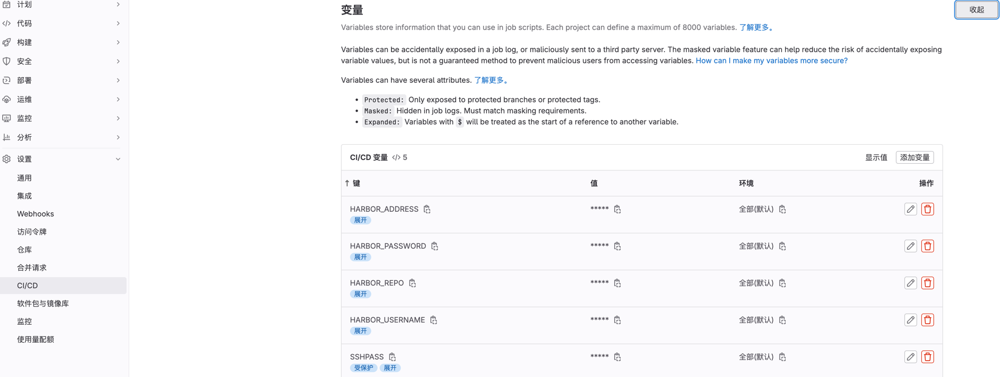

## 介绍

基于前端React技术栈与Golang后端Kratos技术栈组合的规范化最佳实践(个人认为)的前后端项目

优势:

1. 现成的工程化React前端项目
2. 与CI/CD(Continuous integration and continuous deployment)的自动化DevOps集成
3. 支持Docker与Kubernetes部署
4. 集百家所长

### 前端

前端技术栈使用React作为前端kit, 考量有: React灵活, 前端的生态最丰富

- 桌面库: 采用tauri, 一个rust打造的桌面, 占用极小
- CLI: 采用Vite, 现代和快速

### 后端

- 语言选择: 使用Golang的基于DDD思想的Kratos作为后端项目的kit, 即可作为单体架构使用, 也可以作为微服务架构使用
- 协议: HTTP/RPC, 支持HTTP与protobuf协议

### DevOps

支持`Github`部署, `Gitlab CI`部署到Docker或者Kubernetes的shell方式, `Gitlab CI` + `Argocd`的部署到Kubernetes部署方式

优缺点:

- `Github`: 仅支持Github平台, 适合开源项目使用
- `Gitlab CI`: 方便灵活, 仅仅使用`Gitlab CI`部署到Docker或者Kubernetes的shell方式, 不方便追踪部署
- `Gitlab CI` + `Argocd`: 推荐有Kubernetes集群环境的使用, 有规范化的应用清单, 部署清单, 追踪方便

#### CI

支持Gitlab, Github的CI, 内置ci脚本, 根据实际需求修改,
CI的最佳实践有:

1. 保护变量, 利用Gitlab平台提供的变量, 而不是在gitlab.ci.yml中硬编码
2. 如果需要进入到远程基础设施(e.g Linux,Windows)时创建一个最小的权限用户, 给它分配合理的目录权限, 文件执行权限等

#### CD

本项目使用Gitlab + Argo 作为自动化的部署

#### Observability

本仓库的后端项目接口支持Observability可观测性. 使用`opentelemetry`库来对`gRPC`与`HTTP`接口进行采集`指标`/`日志`的遥测数据

#### 网关与安全

TODO

## 快速入门

必须先在根目录进行git的初始化, 因为我在CI/CD流编写了自动获取git仓库地址的sh, 仅在有bash/sh/zsh等unix shell的情况下可以执行

### 前置条件

需要的环境分为:

1. 前端环境
2. 后端环境
3. DevOps环境

#### 前端环境

1. node
2. pnpm

#### 后端环境

1. go
2. protoc
3. protoc-gen-go

#### DevOps环境(可选, 用于CI/CD)

1. Docker: 可选, 如果需要Docker部署的话. 项目包含部署文件, 可直接使用它(Dockerfile 与 docker-compose.yaml)直接部署
2. Kubernetes: 可选, 如果需要DevOps部署的话. 需要一个正常运行的Kubernetes集群, 本项目默认使用LoadBalancer类型, 项目包含部署文件,
   可直接使用它(
   Dockerfile 与 docker-compose.yaml)直接部署
3. Gitlab: 可选, 可以是Gitlab.com账号或者私有的Gitlab仓库, 用于与Gitlab CI + Argocd的Continuous Integration & Delivery

##### Docker部署

本项目的示例部署文件`Dockerfile` 与 `docker-compose.yaml` 分别在`frontend`与`backend`目录下, 分别代表前端与后端的部署.
前端项目的部署流程将项目部署到Nginx容器中
后端项目的部署流程将项目编译为二进制文件

部署示例:

需要再Harbor私有容器注册表或者公有的注册表中创建对应的前端/后端的仓库

```shell
docker build --progress=plain --no-cache -t myusername/myimage:mytag frontend/ -f frontend/Dockerfile
```

##### Kubernetes

Kubernetes的CI/CD流

###### Gitlab CI+ argocd:

定义变量:

```shell
# argocd所在的的命名空间
export ARGOCD_NAMESPACE="argocd"
# 角色名称, 用于管理项目
export ROLE_NAME="lx"
# Kubernetes集群地址
export CLUSTER_SERVER="https://192.168.2.160:6443"

# 前端命名空间, 不需要额外创建命名空间选择default即可
export FRONTEND_NAMESPACE="frontend"
# argocd中的前端项目名, 用于分配团队人员的操作权限
xport FRONTEND_PROJECT_NAME="frontend"
# 前端应用的名称
export FRONTEND_APPLICATION_NAME="react"
# Kubernetes 资源清单在仓库中的路径, 相对于仓库根目录的路径
export FRONTEND_DEPLOY_PATH="frontend/ci"

# 后端端命名空间, 不需要额外创建命名空间选择default即可
export BACKEND_NAMESPACE="backend"
# argocd中的后端项目名, 用于分配团队人员的操作权限
export BACKEND_PROJECT_NAME="backend"
# 后端应用的名称
export BACKEND_APPLICATION_NAME="go"
```

进入到本仓库的根目录进行生成:

```shell
chmod +x kubernetes/argocd/init.sh
./kubernetes/argocd/init.sh
```

## 运行Web项目

1. 初始化git仓库, 不执行husky会报错
    ```shell
    git init
    ```

2. 安装依赖
    ```shell
    pnpm i
    ```

- 本地运行

    ```shell
    pnpm dev
    ```

- 运行Web桌面应用

  > 构建桌面应用需要Rust环境

    ```shell
    pnpm tauri dev
    ```

- 打包

    ```shell
    pnpm build
    ```

- 构建Web桌面应用

> 构建桌面应用需要Rust环境

编辑`project/frontend/src-tauri/tauri.conf.json`文件的tauri.conf.json > tauri > bundle > identifier的"com.tauri.dev"
值改为:""com.tauri.build""
原来的值:

 ```json
 {
  "bundle": {
    "identifier": "com.tauri.dev"
  }
}
 ```

修改后的值:

```json
{
  "bundle": {
    "identifier": "com.tauri.build"
  }
}
```

运行构建

```shell
pnpm tauri build
```

## 运行后端项目

### 准备环境

- Golang
- https://go-kratos.dev/docs/getting-started/start

1. 安装依赖

```shell
kratos upgrade
```

- 运行

```shell
kratos run
```

### 创建微服务

- <path>/<project>: 创建的路径, 例如`service/account`
- -r <https://xxx.git>: 指定的`kratos-layout`的git仓库URL, 例如gitee的`kratos-layout`
  的URL: `https://gitee.com/go-kratos/kratos-layout.git`
- --nomod: 共用 go.mod, 大仓模式
- -b <brach>: 可选, 指定分支, 例如`main`

```shell
kratos new <path>/<project> [-r <https://xxx.git>] [-b <brach>] [--nomod]
```

## 部署

[DevOps工程化](https://juejin.cn/post/7346610589987569664)有详细说明, 这里是简化说明

### 前端

#### Kubernetes

#### Docker

#### 二进制

查看项目根目录的 `deploy/frontend/binary` 定义以下变量:

- DOMAIN: 域名, example.com, 不需要schema
- NGINX_DIR: 存储nginx的绝对路径
- HTML_DIR: 网页文件目录
- CONF_DIR: 配置文件目录
- SSL_DIR: TLS文件目录

```shell
export DOMAIN=""
export NGINX_DIR=""
export HTML_DIR=""
export CONF_DIR=""
export SSL_DIR=""
```

然后执行:

```shell
chmod +x ./deploy/frontend/binary/00-install.sh;./deploy/frontend/binary/00-install.sh 
chmod +x ./deploy/frontend/binary/01-create_systemd.sh;./deploy/frontend/binary/01-create_systemd.sh 
chmod +x ./deploy/frontend/binary/02-create_user.sh;./deploy/frontend/binary/02-create_user.sh 
chmod +x ./deploy/frontend/binary/03-start_nginx.sh;./deploy/frontend/binary/03-start_nginx.sh 
```

#### 后端

> Docker的新版已经删除--progress=plain, 如果遇到--progress=plain的错误, 删掉即可

注意事项:

- 请将 /path/to/configs 替换为实际的本地配置文件路径。
- 将 <appname> 替换为实际的应用程序名称。
- 根据需要调整 replica 数量、Service 类型等配置

最后在安装了Kubernetes的服务器环境上执行:

```shell
kubectl apply -f backend/deployment.yaml
```

### Docker

#### 前端

##### 构建镜像

编辑
> 将`image`: `web`  # 这里需要替换成你使用 `Docker build`的名字

语法:

```shell
docker build [--progress=plain] [--no-cache] -t <user>/<image_name>:<tag> <path>
```

例: 在当前目录构建所有文件, 镜像名为`web`, 不使用`Docker`缓存, 显示构建过程的详细信息

- --progress=plain: 以简洁的方式显示构建进度信息
- --no-cache : 不使用缓存
- web : 构建的镜像名
- . : 当前目录所有文件

```shell
docker build --progress=plain --no-cache -t web .
```

##### 运行镜像

###### docker-compose

选项:

- -f: 指定文件
- -d: 后台执行
- --build: 强制重新构建

```shell
docker-compose up \
-f docker-compose.yml \
-d \
--build
```

###### docker run

选项:
-d：以后台模式运行容器。
--name backend：指定容器的名称为 backend。
--restart unless-stopped：定义容器的重启策略为除非手动停止，否则总是重新启动。
-p 80:80: 将容器内部的 80 端口映射到宿主机的 80 端口
-p 443:443：将容器内部的 443 端口映射到宿主机的 443 端口。
mandala/frontend:v1：指定要运行的镜像为 mandala/frontend 的版本 v1。

```shell
docker run -d \
    --name backend \
    --restart unless-stopped \
    -p 80:80 \
    -p 443:443 \
    mandala/frontend:v1
```

#### 后端

##### 构建镜像

在项目的根目录执行以下脚本

> 如果项目共用一个 go.mod 模块文件, 能够得到完好支持
>
>  `Docker build` 执行时的上下文环境是依据当前执行的目录为主目录, 并非 `Dockerfile` 的目录,
> 例如当前目录为`/app`,  `Dockerfile` 所在的目录是`/app/user/`,执行时是使用`/app`作为主目录, 而不是 `Dockerfile` 的目录
>
> Docker的新版已经删除--progress=plain, 如果遇到--progress=plain的错误, 删掉即可

语法:

```shell
docker build [--progress=plain] [--no-cache] -t <user>/<image_name>:<tag> <path>
```

- --progress=plain: 构建过程中显示的详细信息的格式
- --no-cache: 不使用缓存
- -t: 标签, 例如 myusername/myimage:v1
- web : 构建的镜像名
- . : 当前目录所有文件
  示例:

```shell
docker build -f Dockerfile --progress=plain --no-cache -t mandala/backend:v1 .
```

修改`Dockerfile`的`ENTRYPOINT`, 把`backend` 替换为go mod xxx生成的名称, 也就是go build 之后的应用名称, 例如`backend`

示例:

```
command: ["/app/backend", "-conf", "/data/conf"]
```

##### 运行镜像

###### docker-compose

修改`docker-compose.yml`:

1. 修改`image`:字段为你的镜像URL, 如果已经打包上传到远程容器注册表, 这里就是镜像的完整URL地址.
   如果没有, 那么你需要先使用`docker buiuld`进行操作, 然后填写你在`docker buiuld`时填写的标签,
   例如上一步操作的`mandala/backend:v1`

进入到`docker-compose.yml`所在的目录, 然后运行该应用的容器:

> 建议使用docker-compose的方式, 这种方便记录你的操作, 可以存留你的操作, 而且也方便其他人员查看你的部署文件

启动并后台运行:

```shell
docker-compose up -d
```

停止

```shell
docker-compose down
```

查看容器

```shell
docker-compose ps
```

查看实时日志

```shell
docker-compose logs
```

###### docker run

```shell
docker run -d \
    --name backend \
    --restart unless-stopped \
    -p 30001:30001 \
    -p 30002:30002 \
    -v $(pwd)/configs:/data/conf \
    mandala/backend:v1 /app/backend -conf /data/conf
```

## CI/CD

本项目的CI是分离结构, 前端和后端的部署清单在各自的`ci`目录下

### Gitlab CI + argocd

#### 准备环境

在你的服务器下安装, 在我的[DevOps工程化](https://juejin.cn/post/7346610589987569664)文章里面详细写了如何安装, 这里不在赘述

- Gitlab
- Gitlab Runner

1. 定义变量

Gitlab -> 项目页 -> 设置 -> CI/CD -> 变量 -> 添加:

- REGISTER_ADDRESS: 注册表的地址, 例如`ccr.ccs.tencentyun.com`
- REGISTER_USERNAME: 注册表的用户名
- REGISTER_PASSWORD: 注册表的密码
- REGISTER_REPO: 应用在注册表的空间名, 必须在注册表提前创建, 例如`web`
- SSHPASS: 远程服务器的密码, 是你要上传文件的服务器的密码
  

2. 编辑前端/后端项目目录下的`.gitlab-ci.yml`
   把`variables`里面的变量值都改成你实际的变量值

#### 前端

根据你的实际需求, 修改CI文件

```shell
frontend/.github/workflows/ci.yaml
```

#### 后端

根据你的实际需求, 修改CI文件

```shell
backend/.github/workflows/ci.yaml
```

## 前端工程化

参考[文章](https://juejin.cn/post/7346610589987520512)

## 后端工程化

参考[文章](https://juejin.cn/post/7346519210724278306)

## DevOps工程化

参考[文章](https://juejin.cn/post/7346610589987569664)
